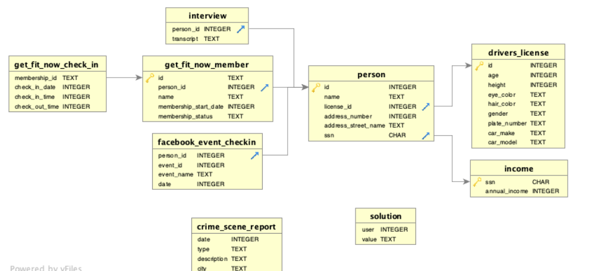

# sql-murder-mystery-game
Let's play a murder mystery game! In this exercise, you will write SQL queries to examine the crime scene data and find out whodunnit! 

 

##Steps 🔎🧐📰 

Create a .sql file in a Github repo called murder-mystery-game.sql. It can be a brand new Github repo or an existing one of your choice (we just need the file to be hosted somewhere on Github so that you can submit the link). 
Start the murder mystery game here: https://mystery.knightlab.com/Links to an external site. 
You will be writing *many* SQL queries to solve the murder mystery. Please document all of the SQL queries that you use in your murder-mystery-game.sql file.
The website does not save your progress when you exit the site, so please remember to track all of your game progress in your murder-mystery-game.sql file.
Have fun! 
 

##How to turn this in
Submit a link to the .sql file on Github that shows all the SQL queries you used to solve the murder mystery. 

###Schema Data
